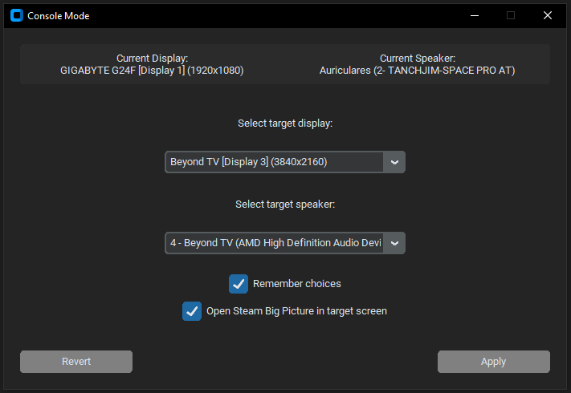

## CONSOLE MODE TOGGLE APP

A lightweight utility to instantly switch your primary monitor, reroute audio, and launch Steam Big Picture mode in one click. Built to seamlessly transition from a desktop to a TV gaming setup.

## Requirements

For the prebuilt release:
* MultiMonitorTool: Handles display profile switching. [Download from NirSoft](https://www.nirsoft.net/utils/multi_monitor_tool.html).
* SoundVolumeView: Manages audio device routing. [Download from NirSoft](https://www.nirsoft.net/utils/sound_volume_view.html).

⚠️ **Both executables must be placed in the same folder as ConsoleMode.exe**

For running from source:  
* customtkinter
* screeninfo
* pycaw
* comtypes
* wmi

## Usage
* Launch the app and select your target gaming display and audio output.
* Toggle whether to remember your choices or auto-launch Steam.
* Click Apply to switch hardware, and Revert to go back to your normal desktop.

